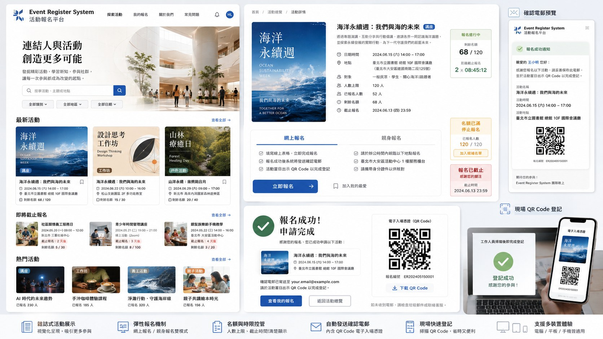

# Event Register System｜活動報名平台

一個可正式部署的活動報名網站，按照已確認的雜誌式概念圖製作。前台以活動海報為核心，後台可管理活動、名額及截止時間；參加者報名成功後會收到附有 QR Code 圖片的確認電郵，工作人員以手機掃描即可完成出席登記。



## 已完成功能

- 雜誌式活動首頁、搜尋及分類篩選
- 活動詳情、開始報名日期、剩餘名額、報名進度及截止倒數
- 可設定即時或指定日期／時間自動開放報名；未開始活動集中顯示於「即將開始報名」
- 網上報名及親身報名預留名額
- 以 PostgreSQL row lock 原子化處理名額，避免同時提交造成超額報名
- 未到開始時間禁止報名，到達人數上限或截止時間後自動停止接受申請
- 報名成功頁及專屬 QR Code 電子入場證
- Resend 確認電郵，QR Code 同時顯示於郵件及以 PNG 附件發送
- 管理員登入、活動新增／修改／取消／刪除
- 管理員可獨立管理首頁主標題、說明文字及橫額圖片，不會影響活動資料
- 管理員可在報名名單手動新增、修改及刪除參加者，並管理出席狀態及匯出 UTF-8 CSV
- Telegram Bot 管理員通知：新報名即時通知，或每 3 小時／12 小時／每天彙總；訊息包含參加者姓名、活動及總報名人數
- Supabase Storage 活動圖片及首頁橫額上載
- 手機相機掃描 QR URL 後進入工作人員出席登記頁
- 重複掃描提示，避免同一憑證重複登記
- Mobile First 響應式介面，支援電腦、平板及手機
- GitHub Actions 自動執行 TypeScript 及正式 Build
- 可存放於 GitHub 並由 GitHub Actions 驗證；可部署至 Vercel 或任何支援 Docker 的雲端平台

## 技術架構

- Next.js 16 App Router
- React 19 + TypeScript
- Supabase Postgres、Auth、Storage、RLS
- Vercel Node.js Functions／Next.js standalone Docker image
- Resend Email API
- Telegram Bot API + Vercel Cron Jobs
- `qrcode` 伺服器端 QR PNG 產生器
- 純 CSS 設計系統，沒有依賴大型 UI framework

> 專案要求 Node.js 22 或以上。Supabase JS 目前版本已不再支援 Node.js 20。

## 1. 本機啟動

```bash
cp .env.example .env.local
npm install
npm run dev
```

瀏覽 `http://localhost:3000`。

未填寫 Supabase 環境變數時，前台會以內置示範資料運作；示範報名會顯示固定 QR 憑證。正式報名、後台、圖片上載及現場登記必須完成以下雲端設定。

## 2. 建立 Supabase 資料庫

1. 在 Supabase 建立新 Project。
2. 開啟 **SQL Editor**。
3. 執行：
   - 全新 Project：`supabase/migrations/202608030001_initial_schema.sql`
   - 已部署舊版本：依序執行 `supabase/migrations/202608040001_add_registration_start_at.sql`、`supabase/migrations/202608040002_add_homepage_hero_settings.sql` 及 `supabase/migrations/202608040003_add_telegram_notifications.sql`
   - 全新 Project 執行初始 schema 後，亦需執行 `202608040003_add_telegram_notifications.sql` 以啟用 Telegram 通知佇列
   - `supabase/seed.sql`（可選，用來加入三個示範活動）
4. 到 Project 的 **Connect / API Keys** 取得：
   - Project URL
   - Publishable key
   - Secret / service role key
5. 將資料填入 `.env.local`：

```env
NEXT_PUBLIC_SUPABASE_URL=https://YOUR_PROJECT.supabase.co
NEXT_PUBLIC_SUPABASE_PUBLISHABLE_KEY=sb_publishable_xxx
SUPABASE_SERVICE_ROLE_KEY=sb_secret_xxx
NEXT_PUBLIC_APP_URL=http://localhost:3000
```

### 安全設計

- `SUPABASE_SERVICE_ROLE_KEY` 只在 Next.js Route Handler 使用，沒有 `NEXT_PUBLIC_` 前綴，不會傳到瀏覽器。
- 公眾只可讀取 `published` 活動。
- `registrations` 沒有任何匿名讀取政策；手動參加者管理只可經已驗證的後台 API 使用。
- 管理員權限來自 `admin_profiles`，不使用可由用戶修改的 `user_metadata` 作授權。
- 報名 RPC 只授權 `service_role` 執行。
- 活動名額於同一資料庫 transaction 鎖定活動列，再驗證開始報名時間、截止時間及名額後新增報名。
- 所有 exposed public tables 已啟用 RLS。

## 3. 建立首位管理員

先確保 `.env.local` 已填寫 Supabase URL 及 service role key，然後執行：

```bash
npm run create-admin -- admin@example.com "StrongPassword123!" "活動管理員"
```

這個 script 會：

1. 建立並確認 Supabase Auth 帳戶。
2. 把帳戶加入 `admin_profiles`。
3. 將 `admin` 放入不可由用戶自行修改的 `app_metadata`。

之後可於 `/admin/login` 登入。

## 4. 設定 QR Code 確認電郵

1. 在 Resend 建立帳戶及 API Key。
2. 驗證寄件網域。
3. 在 `.env.local` 加入：

```env
RESEND_API_KEY=re_xxx
RESEND_FROM_EMAIL=活動報名平台 <events@your-domain.com>
```

未設定 Resend 時，報名仍會成功，QR Code 亦會顯示在成功頁；資料庫的 `email_sent` 會記錄為 `false`，方便管理員跟進。


## 5. 設定 Telegram Bot 通知

Telegram Bot 不能以電話號碼直接尋找或傳送訊息給用戶。你提供的電話號碼不會寫入網站；必須先在 Telegram 主動開啟 Bot 並按 **Start／開始**，系統才可取得 Chat ID。

1. 在 Telegram 開啟 **@BotFather**，建立一個 Bot 並取得 Token。
2. 在 `.env.local` 或 Vercel Environment Variables 加入：

```env
TELEGRAM_BOT_TOKEN=123456789:your_botfather_token
CRON_SECRET=請使用至少16字元的隨機密碼
```

3. 重新部署網站。
4. 登入 `/admin/telegram`。
5. 按「開啟 Telegram 連接」，在 Telegram 對 Bot 按 Start，再返回後台按「完成連接」。
6. 發送測試訊息，選擇頻率並啟用通知。

可選頻率：

- 每當有新報名：報名完成後立即發送；失敗時由排程重試。
- 每 3 小時：把期間內的參加者合併為一則彙總。
- 每 12 小時：把期間內的參加者合併為一則彙總。
- 每天：每 24 小時發送一次彙總。

`vercel.json` 已設定每小時呼叫 `/api/cron/telegram`。系統會檢查管理員所選頻率，只在到期時發送。`CRON_SECRET` 用來驗證 Vercel Cron 的 Authorization header；不要提交到 GitHub。

Bot Token 只由伺服器讀取，不會儲存在 Supabase、瀏覽器或管理後台表單。

## 6. 部署至 GitHub

在專案資料夾執行：

```bash
git init
git add .
git commit -m "Initial event registration platform"
git branch -M main
git remote add origin https://github.com/YOUR_ACCOUNT/YOUR_REPOSITORY.git
git push -u origin main
```

`.env.local` 已列入 `.gitignore`，不要把 secret key 上載到 GitHub。

首次 `npm install` 後請把產生的 `package-lock.json` 一併提交，讓 GitHub Actions、Vercel 及其他雲端環境使用完全一致的依賴版本。其後可把 CI 內的 `npm install` 改為 `npm ci`。

## 7. 部署至 Vercel

1. 在 Vercel 選擇 **Add New → Project**。
2. Import 上一步的 GitHub repository。
3. Framework Preset 選擇 **Next.js**。
4. 在 Environment Variables 加入：
   - `NEXT_PUBLIC_SUPABASE_URL`
   - `NEXT_PUBLIC_SUPABASE_PUBLISHABLE_KEY`
   - `SUPABASE_SERVICE_ROLE_KEY`
   - `NEXT_PUBLIC_APP_URL`（正式網址，例如 `https://events.example.org`）
   - `RESEND_API_KEY`（選填）
   - `RESEND_FROM_EMAIL`（選填）
   - `TELEGRAM_BOT_TOKEN`（Telegram 通知必須）
   - `CRON_SECRET`（Telegram 排程必須，至少 16 字元）
5. Deploy。
6. 任何環境變數修改後，請重新部署，舊 deployment 不會自動取得新值。

Vercel 可選擇 Git-based deployments：推送到 `main` 自動部署 Production，其他 branch 會建立 Preview Deployment。


## 8. 使用 Docker 部署至其他雲端

專案已設定 `output: "standalone"`，並附有多階段 `Dockerfile`。適用於支援 Docker image 的雲端服務或自建伺服器。

```bash
docker build -t event-registration-platform .
docker run --env-file .env.local -p 3000:3000 event-registration-platform
```

容器內只包含正式執行所需的 standalone server、靜態檔案及 public assets。Supabase 仍負責資料庫、登入及圖片儲存，因此不同裝置會共用同一批雲端資料。

## 9. 工作人員現場登記流程

QR Code 內容是一個網址：

```text
https://你的網域/check-in?token=專屬UUID
```

工作人員流程：

1. 以管理員帳戶在手機登入。
2. 使用 iPhone／Android 原生相機掃描參加者 QR Code。
3. 開啟網址並按「確認出席」。
4. 系統寫入 `attended_at`。
5. 再次掃描同一 QR Code 時，頁面會顯示「此憑證已登記」。

此方式不需要額外相機掃描套件，因此在 iOS、Android、桌面及不同瀏覽器上更穩定。

## 10. 建議正式上線前設定

- 把示範活動圖片及文字換成機構內容。
- 在 Supabase Auth 設定較短的 JWT expiry，並限制管理員帳戶。
- 為 Resend 設定 SPF、DKIM 及 DMARC。
- 在 Vercel 綁定自訂網域及 HTTPS。
- 加入私隱政策、收集個人資料聲明及活動條款。
- 以測試活動驗證：最後一個名額、截止時間、重複報名、取消報名及重複 QR 掃描。
- 定期備份 Supabase Database。

## 主要路由

| 路由 | 用途 |
|---|---|
| `/` | 雜誌式活動首頁 |
| `/events/[slug]` | 活動詳情 |
| `/events/[slug]/register` | 報名表 |
| `/registration/success?token=...` | 報名成功及 QR Code |
| `/admin/login` | 管理員登入 |
| `/admin` | 活動管理總覽 |
| `/admin/events/new` | 建立活動 |
| `/admin/events/[id]` | 編輯活動 |
| `/admin/events/[id]/registrations` | 報名及出席名單、CSV 匯出 |
| `/admin/telegram` | Telegram Bot 連接、收件人及通知頻率設定 |
| `/api/cron/telegram` | 由 GitHub Actions 每小時呼叫的受保護通知處理端點 |
| `/check-in?token=...` | 工作人員出席登記 |

## 檔案結構

```text
app/                    Next.js 頁面及 API Route Handlers
components/             可重用 UI 及互動元件
lib/                    資料、Supabase、驗證、電郵及 QR 邏輯
public/images/          概念圖及示範活動圖片
Dockerfile               通用雲端容器部署
scripts/create-admin.mjs
supabase/migrations/    Schema、RLS、RPC、Trigger、Storage
supabase/seed.sql       示範活動
```

## 測試指令

```bash
npm run typecheck
npm run build
```

正式測試應至少包括：

- 同時提交最後一個名額，只應有一個成功。
- 到達截止時間後 API 拒絕報名。
- 相同電郵不可重複登記同一活動。
- 非管理員不可存取活動管理 API、圖片上載及 check-in API。
- service role key、Telegram Bot Token 及 CRON_SECRET 不可出現在瀏覽器 bundle 或 Git repository。
- 啟用 Telegram 通知後，新報名應進入通知佇列；即時及 3／12／24 小時模式均不應重複發送同一報名。

## License

MIT

### Telegram 排程設定（GitHub Actions）

為兼容 Vercel Hobby，定時彙總由 `.github/workflows/telegram-notification-scheduler.yml` 每小時觸發。請在 GitHub Repository Actions secrets 設定：

```text
TELEGRAM_CRON_URL=https://你的正式網域/api/cron/telegram
CRON_SECRET=與 Vercel Production 完全相同的隨機字串
```

`CRON_SECRET` 同時必須加入 Vercel Production Environment Variables。工作流程每小時檢查一次；系統會按後台所選的每 3 小時、每 12 小時或每天決定是否發送。即時新報名通知不需要等待排程。

## Optional participant email

Participant email is optional for both public registration and administrator-managed participant records. When no email is provided, the success page still displays a downloadable QR admission credential, but no confirmation email is sent. Existing deployments must apply `supabase/migrations/202608040004_make_registration_email_optional.sql`.
